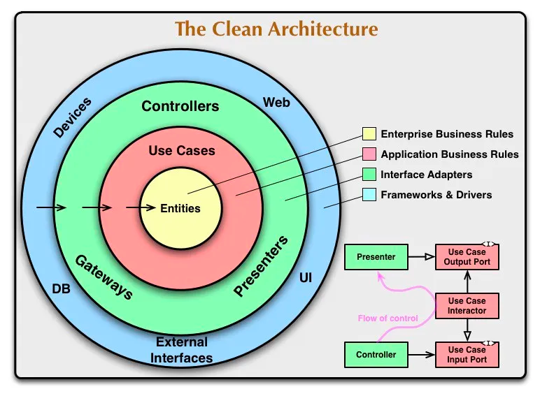
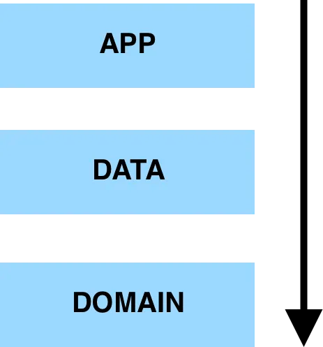

# Clean Architecture

소프트웨어 개발에 있어 견고하고 유지보수가 쉬운 코드를 작성하기 위한 아키텍처 원칙.

애플리케이션의 구조를 **일관되게 유지하고 변경에 유연하게 대응**할 수 있도록 한다.
안드로이드에서 클린 아키텍처를 적용하면 다음의 이점이 있다.

1. **의존성 규칙**: 클린 아키텍처는 외부 프레임워크나 라이브러리에 의존하지 않는 데 중점을 둔다. 이를 통해 안드로이드 애플리케이션의 테스트 용이성과 이식성을 높일 수 있다.
2. **분리된 관심사**: 클린 아키텍처는 각 계층이 독립적으로 동작하도록 설계하여 코드의 각 부분이 서로에게 영향을 주지 않는다. 이를 통해 안드로이드 애플리케이션의 유지보수와 확장성을 향상시킨다.

## 안드로이드에서 클린 아키텍처를 구현하기 위한 주요 계층

### 1. 도메인 계층(Domain Layer)

이 계층은 애플리케이션의 비즈니스 로직을 포함하며 엔티티(Entity), 유스캐이스(UseCase), 저장소 인터페이스(Repository Interfaces)등의 구성 요소로 이루어져 있다.

- 도메인 계층은 애플리케이션의 핵심 기능을 나타낸다.
- **엔티티**: 애플리케이션의 핵심 비즈니스 로직을 나타내는 객체
- **유스케이스**: 애플리케이션에서 수행되는 작업을 나타내며, 애플리케이션의 기능을 구현.
- **저장소 인터페이스**: 데이터 계층과의 통신을 정의하는 인터페이스.

### 2. 데이터 계층(Data Layer)

이 계층은 데이터 저장소와 통신을 담당하며, 로컬 데이터베이스, 웹 서비스, 캐시 등의 구현체를 포함한다. 도메인 계층의 저장소 인터페이스를 구현하여 데이터 소스와의 결합도를 낮춘다.

- 도메인 계층의 저장소 인터페이스 구현을 제공하여 데이터를 가져오거나 저장하는 역할을 담당한다.
- **데이터 소스**: 웹 서비스, 로컬 데이터베이스, 캐시 등과 같은 데이터를 제공하는 구성 요소.
- **저장소 구현**: 도메인 계층의 저장소 인터페이스를 구현하여 데이터를 가져오고 저장하는 역할.

### 3. 프레젠테이션 계층(Presentation Layer)

이 계층은 사용자 인터페이스(UI)와 관련된 코드를 포함한다. 안드로이드에서는 Activity, Fragment, ViewModel, View 등이 여기에 속한다. 프레젠테이션 계층은 도메인 계층의 유스케이스와
통신하며 사용자 입력을 처리하고 결과를 표시한다.

- **Activity와 Fragment**: 사용자 인터페이스를 구성하고 사용자와 상호 작용.
- **ViewModel**: UI의 상태와 로직을 관리하며, 데이터 계층에서 가져온 데이터를 View에 바인딩한다.
- **View**: 사용자 인터페이스 요소를 표시하고 사용자와 상호 작용을 처리.

## 클린 아키텍처의 이점

안드로이드에서 클린 아키텍처를 사용함으로써,애플리케이션의 각 부분을 독립적으로 개발하고 테스트할 수 있다.

- 클린 아키텍처를 적용하려면, 계층 구조를 명확히 정의하고 각 계층의 역할과 책임에 대해 이해해야 한다. 그래야 견고하고 유지보수가 쉬운 코드를 작성하고, 효율적인 애플리케이션 개발을 실현할 수 있다.

1. **테스트 용이성**: 각 계층이 독립적으로 작동하므로, 테스트를 보다 쉽게 수행할 수 있따. 도메인 계층은 비즈니스 로직에 대한 단위 테스트를, 프레젠테이션 계층은 UI 테스트를, 데이터 계층은 데이터
   소스와의 통신
   테스트를 진행할 수 있다.
2. **읽기 쉬운 코드**: 클린 아키텍처를 적용하면 코드의 가독성이 높아진다. 각 계층은 명확한 역할과 책임을 가지며, 각각의 코드는 작은 단위로 분리되어 있어 이해하기 쉽다.
3. **유연성**: 클린 아키텍처를 사용하면 애플리케이션의 변경에 대처하기 쉬워진다. 예를 들어, 데이터 저장소의 변경이 필요한 경우 데이터 계층만 수정하면 되며, 프레젠테이션 계층과 도메인 계층에는 영향이 없다.
4. **재사용성**: 클린 아키텍처의 구성 요소는 재사용 가능한 모듈로 구성된다. 이를 통해 팀원 간의 협업이 용이하며, 다른 프로젝트에도 쉽게 적용할 수 있다.

## References

더 자세한 설명이 다음 웹 사이트에 나와있다.

- https://medium.com/android-dev-hacks/detailed-guide-on-android-clean-architecture-9eab262a9011