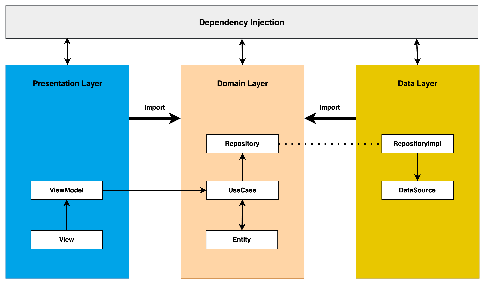

# 안드로이드에 맞게 클린아키텍처 설계하기

클린 아키텍처를 어떻게 안드로이드에 적절하게 적용시킬 것인가...

## 레이어 구분

각 레이어 별로 의존성을 최소화하기 위해 DI가 필요해짐.

### Presentation Layer

사용자 인터페이스를 담당하는 레이어. Activity, Fragment, View, ViewModel 등으로 구성.
사용자 입력을 처리하고, 데이터를 화면에 표시하며 이 레이어는 UI와 관련된 코드만 포함하며, **비즈니스 로직은 포함하지 않음**.

### Domain Layer

- 애플리케이션의 비즈니스 로직을 담당.
- **Use case**, **Entity**, **Interface**로 구성.
- Use case는 애플리케이션의 기능을 구현하는 로직을 담당.
- Entity는 데이터 모델을 담당
- Interface는 Data Layer의 구현체를 표현

### Data Layer

- 애플리케이션에서 사용하는 데이터를 관리.
- **Repository**, **DataSource** 등으로 구성.
- 데이터를 로컬 데이터베이스나 서버에서 가져와 Use case에 전달.

