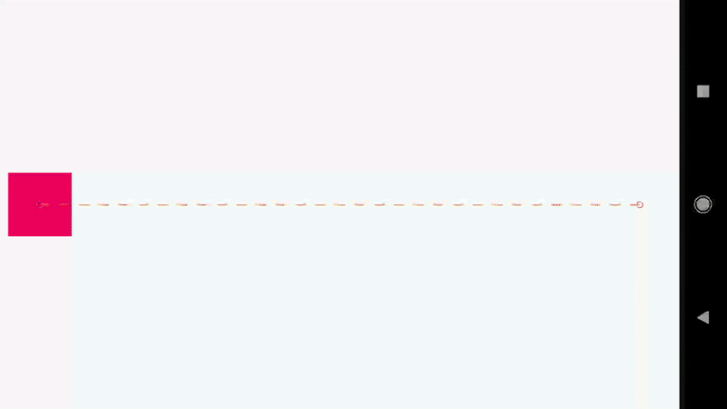

# MotionLayout

- MotionLayout은 안드로이드 앱에서 애니메이션 및 전환을 다루기 위한 레이아웃
- ConstraintLayout의 확장 버전으로, 사용자 인터페이스 요소 간의 움직임과 변화를 설명하는 XML 기반의 도구.
- MotionLayout은 Android Jetpack의 일부로서 지원됨.

## 주요 기능

1. 선언적 애니메이션: MotionLayout은 XML 파일을 사용하여 애니메이션을 정의하므로, 코드와 애니메이션 로직을 분리할 수 있다. 이를 통해 애니메이션 관련 코드를 줄이고, 유지보수성과 가독성을 향상시킬
   수 있다.
2. 복잡한 전환 및 애니메이션: MotionLayout을 사용하면 여러 개의 위젯을 동시에 애니메이션 할 수 있으며, 동시에 실행되는 여러 개의 전환을 제어할 수 있다. 이를 통해 복잡한 움직임 및 상호 작용을
   손쉽게 구현할 수 있다.
3. 터치 및 드래그 인터랙션 지원: MotionLayout은 사용자의 터치 이벤트에 따라 애니메이션을 쉽게 조절할 수 있도록 지원한다. 이를 통해 사용자 인터랙션에 따라 애니메이션을 부드럽게 실행할 수 있다.
4. 높은 확장성 및 커스터마이징: 사용자 정의 속성 및 키 프레임을 사용하여 애니메이션을 미세 조정할 수 있다. 이를 통해 애니메이션의 시간, 속도, 간격 등을 쉽게 조절하고, 고유한 사용자 경험을 제공할 수
   있다.



https://developer.android.com/training/constraint-layout/motionlayout?hl=ko

```xml
    <?xml version="1.0" encoding="utf-8"?>
    <!-- activity_main.xml -->
    <androidx.constraintlayout.motion.widget.MotionLayout
        xmlns:android="http://schemas.android.com/apk/res/android"
        xmlns:app="http://schemas.android.com/apk/res-auto"
        xmlns:tools="http://schemas.android.com/tools"
        android:id="@+id/motionLayout"
        android:layout_width="match_parent"
        android:layout_height="match_parent"
        app:layoutDescription="@xml/scene_01"
        tools:showPaths="true">

        <View
            android:id="@+id/button"
            android:layout_width="64dp"
            android:layout_height="64dp"
            android:background="@color/colorAccent"
            android:text="Button" />

    </androidx.constraintlayout.motion.widget.MotionLayout>
```

XML 코드를 보면 scene_01이란 코드가 보이는데 이것을 추가해서 사용한다.

### scene_01
```xml
    <?xml version="1.0" encoding="utf-8"?>
    <MotionScene xmlns:android="http://schemas.android.com/apk/res/android"
        xmlns:motion="http://schemas.android.com/apk/res-auto">

        <Transition
            motion:constraintSetStart="@+id/start"
            motion:constraintSetEnd="@+id/end"
            motion:duration="1000">
            <OnSwipe
                motion:touchAnchorId="@+id/button"
                motion:touchAnchorSide="right"
                motion:dragDirection="dragRight" />
        </Transition>

        <ConstraintSet android:id="@+id/start">
            <Constraint
                android:id="@+id/button"
                android:layout_width="64dp"
                android:layout_height="64dp"
                android:layout_marginStart="8dp"
                motion:layout_constraintBottom_toBottomOf="parent"
                motion:layout_constraintStart_toStartOf="parent"
                motion:layout_constraintTop_toTopOf="parent" />
        </ConstraintSet>

        <ConstraintSet android:id="@+id/end">
            <Constraint
                android:id="@+id/button"
                android:layout_width="64dp"
                android:layout_height="64dp"
                android:layout_marginEnd="8dp"
                motion:layout_constraintBottom_toBottomOf="parent"
                motion:layout_constraintEnd_toEndOf="parent"
                motion:layout_constraintTop_toTopOf="parent" />
        </ConstraintSet>

    </MotionScene>
```

- `Transition`에 대해 알아야 사용할 수 있다.
- `OnSwipe`에 대해 알아야 사용할 수 있다.