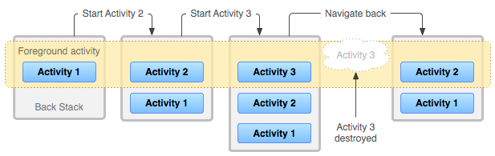

# Android Jetpack Navigation

Jetpack Navigation은 앱 내의 화면 간 이동 및 탐색을 단순화하고, 일관성 있는 사용자 경험을 제공하는 것을 목표로 한다.

## 구성 요소

1. Navigation Graph: 앱의 모든 화면(또는 프래그먼트)과 이들 간의 관계를 정의하는 XML 파일. Navigation Graph를 사용하면, 앱의 전체 구조를 한눈에 볼 수 있고, 특정 화면 간 연결
   관계를 쉽게 파악할 수 있다.
2. NavHostFragment: 화면 내에서 이동을 담당하는 호스트 프래그먼트. NavHostFragment는 Navigation Graph에 정의된 대상 화면으로 이동을 수행하며, 화면 전환 애니메이션도
   자동으로 처리한다.
3. NavController: 앱의 전반적인 탐색 로직을 관리하는 컨트롤러. NavController를 사용하여 화면 간 이동을 명령할 수 있으며, 뒤로 가기 동작이나 화면의 상태를 저장/복원하는 작업도 처리할 수
   있다.

## 장점??

- 일관성 있는 사용자 경험: 뒤로 가기 버튼, 홈 버튼 등의 시스템 UI를 통한 이동을 자동으로 처리해준다.
- Deep link 지원: 앱 내 특정 화면으로 이동할 수 있는 URI 링크를 쉽게 구현할 수 있다.
- 화면 전환 애니메이션: 표준화된 애니메이션을 사용하여 화면 전환을 부드럽게 처리한다.
- 코드 간결성: 코드에서 직접 프래그먼트를 생성하고 관리할 필요 없이, Navigation Graph에 정의된 화면 구조를 사용할 수 있다.

## 뒤로 가기 동작 관리에 대해

뒤로 가기 동작 관리는 Android 앱 내 탐색에서 중요한 부분이다. 사용자는 기기의 뒤로 가기 버튼을 누름으로써 이전 화면으로 돌아갈 수 있어야 하며, 이 동작은 안드로이드의 사용자 경험 가이드라인에서도
강조된다.

Jetpack Navigation의 `NavController`는 뒤로 가기 동작을 자동으로 처리하므로, 개발자는 별도의 구현 없이 이 기능을 사용할 수 있다.

### NavController가 뒤로 가기 동작을 관리하는 방법

1. 탐색 스택 유지: `NavController`는 앱 내에서 탐색이 발생할 때마다 프래그먼트(또는 액티비티)의 탐색 스택을 유지한다. 이 스택은 현재까지 이동한 화면의 기록을 담고 있으며 사용자가 뒤로 가기
   버튼을 누르면 이전 화면으로 돌아갈 수 있도록 한다.
2. 뒤로 가기 버튼 이벤트 처리: 사용자가 뒤로 가기 버튼을 누르면, `NavController`는 탐색 스택에서 가장 최근에 추가된 항목을 제거하고 이전 프래그먼트로 이동한다. 이 과정에서 화면 전환 애니메이션도
   자동으로 적용된다.
3. 탐색 스택 비우기: 특정 경우에는 사용자가 뒤로 가기 버튼을 눌렀을 때 이전 화면이 아닌 다른 화면으로 이동하도록 설정해야 할 것이다. 예를 들어, 로그인 후 메인 화면으로 이동한 사용자가 뒤로 가기 버튼을
   눌렀을 때 로그인 화면이 아닌 앱을 종료하도록 만들 수 있어야 할 것이다. 이를 위해 `NavController`에서는 탐색 옵션을 통해 탐색 스택을 비우거나 특정 프래그먼트까지 돌아가도록 설정할 수 있다.
4. 뒤로 가기 동작 커스터마이징: 필요한 경우 `NavController`에 `OnBackPressedDispatcher`를 이용하여 뒤로 가기 동작을 추가하거나 변경할 수 있다. 이를 통해 앱의 특정 상황에 따라
   뒤로 가기 동작을 더욱 세밀하게 제어할 수 있다.

#### android backstack

- LIFO(Last In First Out)구조: 탐색 스택은 LIFO 데이터 구조를 사용한다. 이는 가장 최근에 추가된 항목이 가장 먼저 제거되는 구조로, 사용자가 뒤로 가기 버튼을 누르면 이전 화면으로 돌아가는
  동작을 구현하는 데 적합하다.
- 액티비티 또는 프래그먼트 저장: 사용자가 앱 내에서 화면을 이동하면, 대상 액티비티 또는 프래그먼트가 backstack에 추가된다. 이렇게 하면 앱의 탐색 경로를 기록하고 관리하기 용이하다.
- 뒤로 가기 동작: 사용자가 뒤로 가기 버튼을 눌렀을 때 backstack의 맨 위 액티비티 또는 프래그머늩가 제거되고 이전 화면으로 돌아간다. 만약 backstack이 비어있을 경우, 기본적으로 앱이 종료된다
- **액티비티 라이프사이클 관리**: Backstack은 화면 전환 시 액티비티의 라이프사이클 메서드 호출을 관리한다. 액티비티가 backstack에 추가되면서 `onPause()`, `onStop()` 메서드가
  호출되고, 이전 화면으로 돌아갈 때 `onResume()`, `onStart()` 메서드가 호출된다.

Android Jetpack Navigation은 액티비티 대신 프래그먼트를 사용하여 backstack을 구성한다. NavController 객체가 backstack을 관리하여 프래그먼트 간의 탐색을 쉽게 구현할 수
있도록 돕는다.
(앱 내 탐색 로직의 복잡성을 줄일 수 있다.)