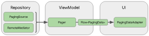

# Paging3

데이터를 순차적으로 불러올 수 있는 Jetpack 라이브러리

대용량 데이터를 효율적으로 로드하고 표시할 수 있도록 도와주는 라이브러리.
데이터를 페이지 단위로 로드하여 사용자 인터페이스에 표시함으로써 메모리 사용량을 줄이고, 네트워크 또는 로컬 저장소에 대한 요청을 최소화한다.
Paging3는 비동기 처리를 지원하며, 코루틴과 Flow를 사용하여 백그라운드에서 데이터를 로드할 수 있다.


https://developer.android.com/topic/libraries/architecture/paging/v3-overview

The Paging library integrates directly into the recommended Android app architecture. The library's components operate
in three layers of your app:

- The repository layer
- The ViewModel layer
- The UI layer

## 주요 기능

1. 효율적인 데이터 로딩: 페이지 단위로 데이터를 로드하여 메모리 사용량을 줄이고, 네트워크 또는 로컬 저장소에 대한 요청을 최소화한다.

페이징된 데이터를 메모리에 캐싱한다. 시스템 리소스를 효과적으로 사용할 수 있게 된다. 요청 중복 방지를 통해 네트워크 대역폭과 시스템 리소스를 효과적으로 사용할 수 있다.

2. 유연한 데이터 소스 지원: 네트워크, 로컬 저장소 또는 다른 데이터 소스에서 데이터를 로드할 수 있다. Paging3는 데이터 소스를 쉽게 교체하거나 결합할 수 있도록 도와준다.
3. RecyclerView와의 통합: Paging3는 RecyclerView와 잘 통합되어, 로드된 데이터를 효율적으로 표시할 수 있다. 또한 기본 제공되는 `PagingDataAdapter`를 사용하면 데이터
   변경에 대응하는 코드를 줄일 수 있다.
4. 코루틴과 Flow 지원: Paging3는 코루틴과 Flow를 사용하여 백그라운드에서 데이터를 비동기적으로 로드할 수 있다. 이를 통해 UI 스레드를 차단하지 않고 데이터를 로드할 수 있으며, 백프레셔를 자동으로
   처리할 수 있다.
5. 오류 처리 및 재시도: Paging3는 오류 발생 시 쉽게 처리하고 재시도할 수 있는 기능을 제공한다. 이를 통해 사용자 경험을 개선할 수 있다.

Paging3를 사용하려면 다음 작업이 필요하다.

1. Paging3 라이브러리 추가: 프로젝트에 Paging3 라이브러리를 추가
2. 데이터 소스 구현: 데이터를 로드하는 로직을 구현하는 `PagingSource`와 `PagingConfig`를 생성.
3. PagingDataAdapter 생성: 데이터를 표시하는 RecyclerView에 사용할 `PagingDataAdapter`를 생성하고 구현한다.
4. 데이터 로드 및 표시: ViewModel에서 `Pager`를 사용하여 `PagingData`를 로드하고, 이를 `PagingDataAdapter`에 제공하여 RecyclerView에 표시한다.

사용자가 데이터를 스크롤하여 탐색할 때, Paging3는 자동으로 추가 데이터 페이지를 로드하고 더 많은 항목을 표시할 준비가 되도록 한다. 이를 통해 앱의 성능을 향상시키고 사용자 경험을 개선할 수 있다.

5. 데이터 로드 상태 처리: 로딩 상태 및 오류를 사용자에게 표시하려면 `LoadStateAdapter`를 구현하여 RecyclerView에 추가한다. 이를 통해 사용자는 데이터 로드 상태를 파악하고, 문제가 발생한 경우 재시도할 수 있다.

### 데이터 소스 구현

```kotlin
import androidx.paging.PagingSource

class MyPagingSource(private val apiService: ApiService) : PagingSource<Int, Data>() {

    override suspend fun load(params: LoadParams<Int>): LoadResult<Int, Data> {
        val page = params.key ?: 1

        return try {
            val response = apiService.getData(page)
            val nextPage = if (response.isEmpty()) null else page + 1
            LoadResult.Page(response, prevKey = null, nextKey = nextPage)
        } catch (e: Exception) {
            LoadResult.Error(e)
        }
    }
}
```

### PagingDataAdapter 생성 (MyPagingDataAdapter.kt)

```kotlin
import androidx.paging.PagingDataAdapter
import androidx.recyclerview.widget.DiffUtil

class MyPagingDataAdapter :
    PagingDataAdapter<Data, MyViewHolder>(DATA_COMPARATOR) {

    override fun onCreateViewHolder(parent: ViewGroup, viewType: Int): MyViewHolder {
        // Create your ViewHolder here
    }

    override fun onBindViewHolder(holder: MyViewHolder, position: Int) {
        holder.bind(getItem(position))
    }

    companion object {
        private val DATA_COMPARATOR = object : DiffUtil.ItemCallback<Data>() {
            override fun areItemsTheSame(oldItem: Data, newItem: Data): Boolean {
                // Compare items
            }

            override fun areContentsTheSame(oldItem: Data, newItem: Data): Boolean {
                // Compare contents
            }
        }
    }
}
```

### 데이터 로드 및 표시 (MyViewModel.kt)

```kotlin
import androidx.paging.Pager
import androidx.paging.PagingConfig
import androidx.paging.PagingData
import kotlinx.coroutines.flow.Flow

class MyViewModel(private val apiService: ApiService) : ViewModel() {

   fun getData(): Flow<PagingData<Data>> {
      return Pager(
              config = PagingConfig(pageSize = 20, enablePlaceholders = false),
              pagingSourceFactory = { MyPagingSource(apiService) }
      ).flow
   }
}
```

### 데이터 로드 상태 처리 (MyLoadStateAdapter.kt)

```kotlin
import androidx.paging.LoadState
import androidx.paging.LoadStateAdapter

class MyLoadStateAdapter(private val retry: () -> Unit) :
    LoadStateAdapter<MyLoadStateViewHolder>() {

    override fun onCreateViewHolder(parent: ViewGroup, loadState: LoadState): MyLoadStateViewHolder {
        // Create your LoadStateViewHolder here
    }

    override fun onBindViewHolder(holder: MyLoadStateViewHolder, loadState: LoadState) {
        holder.bind(loadState)
        holder.retryButton.setOnClickListener {
            if (loadState is LoadState.Error) {
                retry()
            }
        }
    }
}
```

### 액티비티 또는 프래그먼트에서 `PagingDataAdapter` 및 `LoadStateAdapter`를 설정

```kotlin
class MyActivity : AppCompatActivity() {

    private val viewModel: MyViewModel by viewModels()
    private lateinit var adapter: MyPagingDataAdapter
    private lateinit var loadStateAdapter: MyLoadStateAdapter

    override fun onCreate(savedInstanceState: Bundle?) {
        super.onCreate(savedInstanceState)
        setContentView(R.layout.activity_main)

        adapter = MyPagingDataAdapter()
        loadStateAdapter = MyLoadStateAdapter { adapter.retry() }

        recyclerView.adapter = adapter.withLoadStateHeaderAndFooter(
            header = loadStateAdapter,
            footer = loadStateAdapter
        )

        lifecycleScope.launchWhenCreated {
            viewModel.getData().collectLatest { pagingData ->
                adapter.submitData(pagingData)
            }
        }
    }
}
```