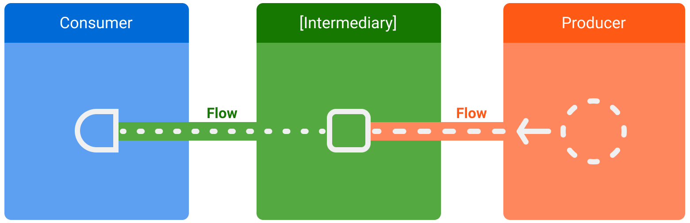

# Flow

- 비동기 데이터 스트림을 처리하는 Kotlin에서 제공하는 방법 중 하나.
- 코루틴 플로우는 코루틴을 사용하여 비동기적으로 데이터를 생성하고 처리하는 프로그래밍 패러다임.

### 주요 특징

1. 비동기적: 코루틴 플로우는 비동기적으로 실행되며, 별도의 스레드에서 동작할 수 있다. 이를 통해 메인 스레드에서 실행되지 않아도 되는 작업을 효율적으로 처리할 수 있다.
2. [느슨한 결합](..%2F%EB%8A%90%EC%8A%A8%ED%95%9C%20%EA%B2%B0%ED%95%A9.md): 코루틴 플로우는 생성자와 수신자 사이에 느슨한 결합을 제공한다. 이를 통해 코드를 더
   유연하게 설계하고, 변경하기 쉬운 구조로 만들 수 있다.
3. 취소 가능: 코루틴 플로우는 취소 기능을 지원하여, 필요한 경우 작업을 취소할 수 있다. 이를 통해 불필요한 작업이 계속 실행되는 것을 방지하고, 자원을 절약할 수 있다.
4. [백프레셔](%EB%B0%B1%ED%94%84%EB%A0%88%EC%85%94.md) 지원: 코루틴 플로우는 백프레셔(backpressure)를 지원하여, 데이터 생성 속도와 소비 속도의 차이를 관리할 수
   있다. 이를 통해 소비자가 과부하 상태에 빠지지 않도록 보장한다.
5. 연산자: 코루틴 플오우는 다양한 연산자를 제공하여, 데이터 스트림을 손쉽게 변환하고, 필터링하고, 병합할 수 있다.
   코루틴 플로우를 사용하려면 `kotlinx.coroutines` 라이브러리를 사용해야 한다. 이 라이브러리는 코루틴을 기반으로 하는 다양한 비동기 작업을 처리하는 도구를 제공한다.

### suspend function과는 다르게 여러 값을 순차적으로 내보낼 수 있는 유형.

- 예를 들어 Flow를 사용해서 데이터베이스를 실시간으로 업데이트 받을 수 있다.
- Flow는 코루틴을 기반으로 빌드되어 여러 값을 제공할 수 있다.
- Flow는 비동기로 개선할 수 있는 데이터스트림의 개념이다.
- 내보낸 값은 동일 유형이어야 한다.
- 빌더 스트림에는 아래의 세 가지 항목이 존재한다.
    - **생산자**: 스트림에 추가되는 데이터를 생산 -> 코루틴 덕에 Flow는 비동기적으로 데이터를 생산 할 수 있다.
    - **중개자**: 스트림에 내보내는 각각의 값이나 스트림 자체를 수정
    - **소비자**: 스트림의 값을 사용



https://developer.android.com/kotlin/flow

Flow를 사용하기 위해서 Flow 빌더 API를 이용할 수 있다.

## Flow 생성

```kotlin
class NewsRemoteDataSource(
        private val newsApi: NewsApi,
        private val refreshIntervalMs: Long = 5000
) {
    val latestNews: Flow<List<ArticleHeadline>> = flow {
        while (true) {
            val latestNews = newsApi.fetchLatestNews()
            emit(latestNews) // Emits the result of the request to the flow
            delay(refreshIntervalMs) // Suspends the coroutine for some time
        }
    }
}

interface NewsApi {
    suspend fun fetchLatestNews(): List<ArticleHeadline>
}
```

위 코드에서는 데이터 소스는 고정된 간격으로 최신 뉴스를 자동으로 가져오는 코드이다. suspend function은 연속된 값을 여러개 반환할 수 없기 때문에, 데이터소스가 이러한 요구사항을 충족하는 플로우를
만들고 반환한다. 이 경우, 데이터소스가 생산자 역할을 하게 된다.

## 스트림 수정

```kotlin
class NewsRepository(
        private val newsRemoteDataSource: NewsRemoteDataSource,
        private val userData: UserData,
) {
    /**
     * Returns the favorite latest news applying transformations on th flow.
     * These operations are lazy and don't trigger the flow. They just transform
     * the current value emitted by the flow at that point in time.
     */
    val favoriteLatestNews: Flow<List<ArticleHeadline>> =
            newsRemoteDataSource.latestNews
                    // Intermediate operation to filter the list of favorite opics
                    .map { news -> news.filter { userData.isFavoriteTopic(it) } }
                    // Intermediate operation to save the latest news in the cache
                    .onEach { news -> saveInCache(news) }
}
```

중개자는 중간 연산자를 사용해서 값을 소비하지 않고도, 데이터 스트림을 수정할 수 있다. 이 연산자는 데이터 스트림에 적용되는 경우, 값이 나중에 사용될 때까지 실행되지 않는 작업을 설정하는 함수이다.
이 코드에서 중간에 사용된 중간 연산자 `map`을 사용해서 데이터가 뷰에 표시되도록 변환한다.

## Flow 수집

```kotlin
class LatestNewsViewModel(
        private val newsRepository: NewsRepository,
) : ViewModel() {

    init {
        viewModelScope.launch {
            // Trigger the flow and consume its elements using collec
            newsRepository.favoriteLatestNews.collect { favoriteNews ->
                // Update View with the latest favorite news
            }
        }
    }
}
```

스트림의 모든 값을 가져오려면 collect를 사용하여 데이터를 가져올 수 있다. collect는 suspend function이기 때문에 코루틴 내에서만 실행해야 한다.
모든 새로운 값에 대해 호출되는 매개변수로 람다를 사용한다. suspend function이기 때문에 collect를 호출하는 코루틴은 플로우가 종료될 때까지 정지될 수 있다.
collect를 사용하여 데이터를 가져오는 부분이 소비자의 역할을 하게 된다.

