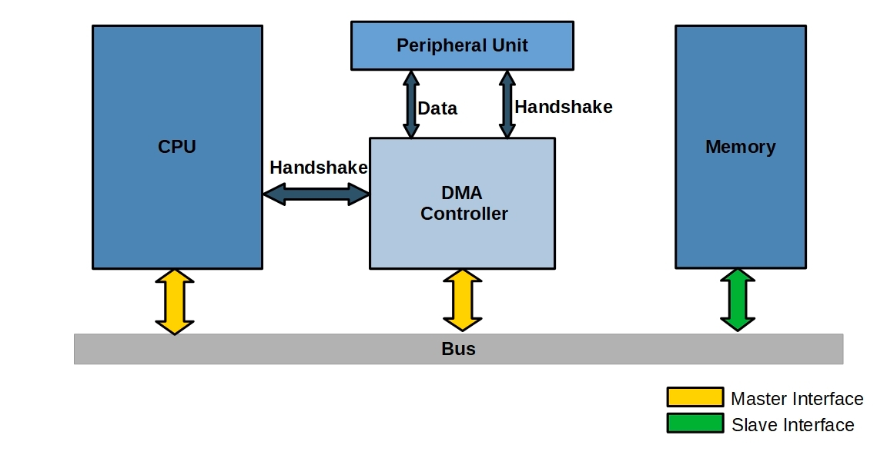
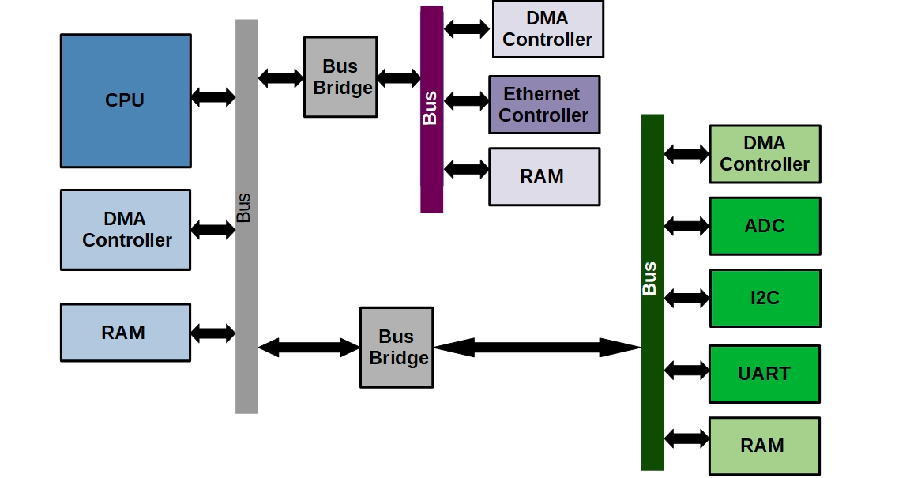

# DMA (Direct Memory Access)
- DMA (Direct Memory Access)
  - 빠른 입출력 장치를 메모리에 가까운 속도로 처리하기 위해 사용
  - CPU의 중재 없이 device controller가 device의 buffer storage의 내용을 메모리에 block 단위로 직접 전송
  - 바이트 단위가 아니라 block 단위로 인터럽트를 발생시킴

주변장치의 데이터는 장치 컨트롤러에 의해 로컬 버퍼로 이동한다. 
그러나 전송할 데이터가 많은 경우, 많은 양의 데이터의 이동으로 인한 부담이 커지는데 이러한 문제를 해결하기 위해 DMA를 이용한다. 
장치 컨트롤러가 데이터의 한 블록을 이동시키는데 이 과정에서 DMA로 인해 CPU의 개입이 필요없게 된다. CPU에서는 데이터 이동이 완료되었다는 단 한 번의 인터럽트만 발생한다. 
데이터가 전송되는 동안 CPU는 다른 작업을 수행할 수 있게 되어 효율성이 높아진다.

사진 출처: [https://open4tech.com/direct-memory-access-dma-in-embedded-systems/](https://open4tech.com/direct-memory-access-dma-in-embedded-systems/)
